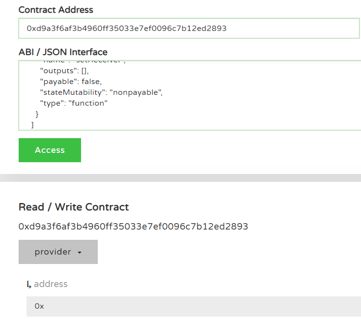
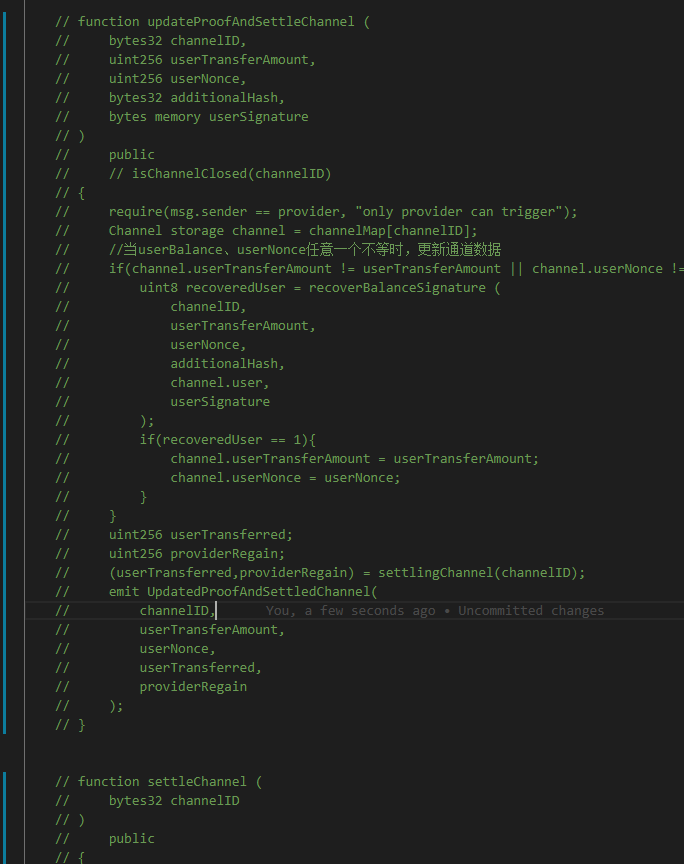
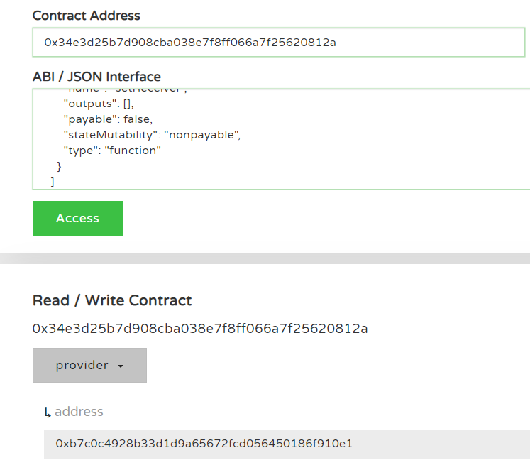
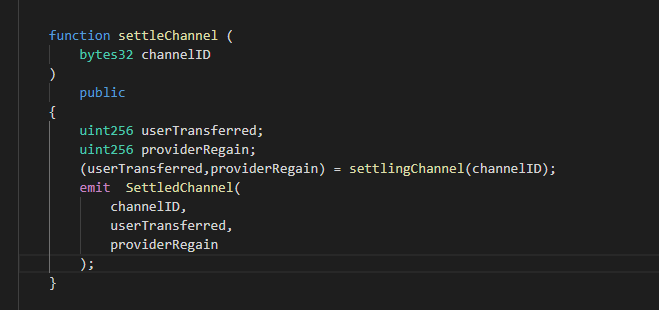
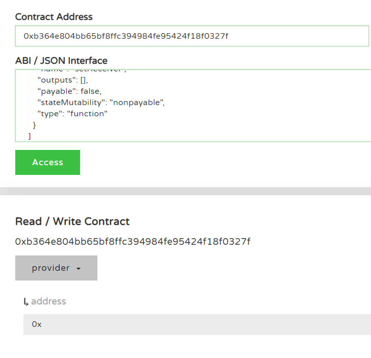
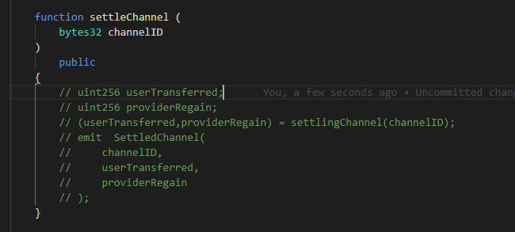
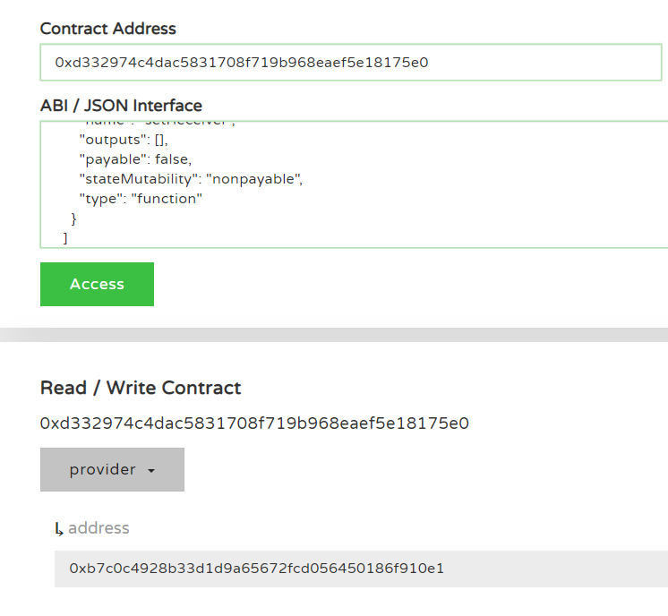
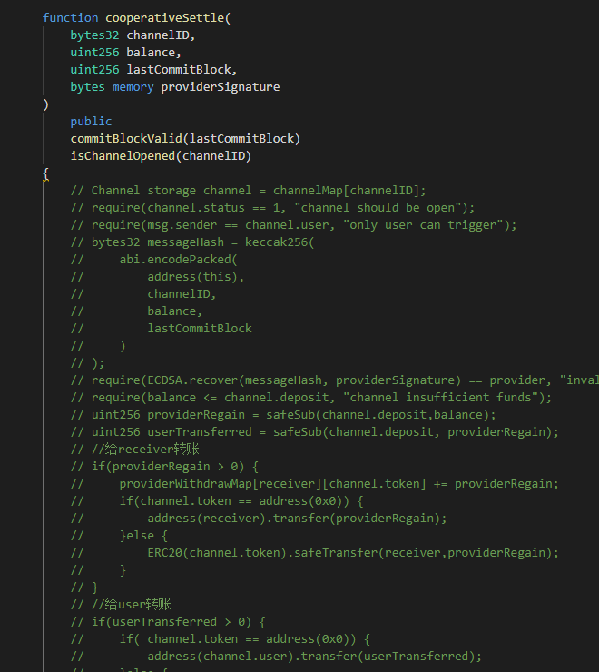

### Here are my questions,plwase read them
My contract is in contracts directory，My deployment script is in deploy directory. Here is my deployment process, which includes successful and failed deployments
#### First I don't remove any methods to deploy,failed

#### second I  remove cooperativeSettle, userCloseChannel, updateProofAndSettleChannel and settleChannel functions.then i redeploy,success

#### third i open settleChannel function,i failed

#### fourth i remove content of settleChannel,i success

#### fifth i open cooperativeSettle function and remove it's content,i failed

